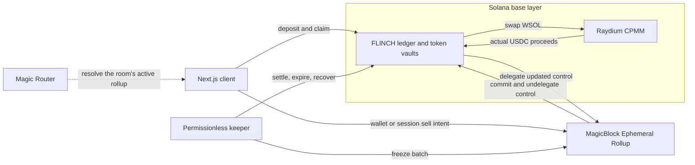

# FLINCH

Sell first. Pay the holders.

A four-player game of chicken on Solana. Everyone puts in the same amount of wrapped SOL, and the round lasts 90 seconds. You can hold or sell. Selling swaps your WSOL for USDC, but a small cut of your WSOL goes to everyone still holding.

Hold longer and you collect those cuts. Sell and you leave with what the swap actually returned. If you're the last holder, you keep your WSOL and everything you've earned along the way. If several players are still holding when time runs out, they each keep their share. Nobody gets picked as a loser.

Built for MagicBlock Blitz V8, with live sell intents on an Ephemeral Rollup and real Raydium swaps on Solana.

Play on Devnet: [flinch.up.railway.app/play](https://flinch.up.railway.app/play). The frontend, signing keeper and PostgreSQL are running on Railway with transactions enabled. A four-wallet public-browser round completed three real swaps and four exact withdrawals. No local keeper is required. See [Railway hosting](docs/RAILWAY.md) for evidence, updates and operating limits.

| | |
| --- | --- |
| Players | 4, with equal stakes |
| Round | 90 seconds |
| Starting stake | 0.001 WSOL by default |
| Sell penalty | 0.25%, paid to the remaining holders |
| Protocol fee | None; network and DEX fees are separate |
| Status | Experimental devnet deployment; ten live rounds verified |

## How the game works

1. Create a room and share its invite. Four different wallets join with equal WSOL stakes.
2. Once all four deposits confirm, the round starts. Holding takes no action.
3. To sell, review the pool quote, penalty and minimum USDC you'll accept, then submit your sell intent.
4. Intents are grouped into two-second windows. Everyone selling in the same batch gets the same treatment; they don't collect penalties from each other.
5. Each seller pays 0.25% of their current WSOL balance, including any holder bonuses they've earned. That penalty is split equally among holders outside the batch.
6. The rest is swapped in one Raydium trade. Sellers share the actual USDC received in proportion to the WSOL they sold. If anyone's minimum isn't met, the whole transaction reverts, including the penalties.
7. Sellers can claim their USDC after settlement. The last holder wins by staying in and can claim their remaining WSOL. That final holder can't sell through the game.
8. If multiple holders remain at timeout, they keep their WSOL. If every remaining holder sells in the same batch, nobody pays a holder penalty and everyone exits into USDC.

A queued sell isn't a completed sale. You're still exposed to WSOL until the swap confirms on Solana. The round clock keeps running while a batch returns from the rollup and settles; new intents pause during that handoff.

Failed or expired batches charge no game penalty, though network fees may still apply. If a round gets stuck, anyone can trigger recovery on Solana 30 seconds after the round ends. Unsold WSOL becomes claimable, and USDC from earlier successful sales stays yours.

All token amounts use integer arithmetic. The exact rounding, retry limits and timing rules are in [Game rules](docs/GAME_RULES.md).

## Why MagicBlock

The shared part of FLINCH is watching the other players and deciding when to leave. MagicBlock handles those live sell intents, and Session Keys let players submit them without approving a new wallet popup each time.

Only the room's control account goes to the Ephemeral Rollup. The WSOL, USDC and record of what each player owns stay on Solana. At the end of a batch, control returns to Solana, the program makes the Raydium swap, and the updated control account can be delegated again.

This doesn't make a DEX trade instant. It separates the live game interaction from the actual exchange of tokens. There's no VRF draw: who holds and who sells decides the outcome.

## Architecture



**Solana base layer** holds the stakes, player balances and settlement receipts. The FLINCH program checks the returned batch, swaps through the room's fixed Raydium pool, and records the result in one transaction. Claims go to the player's own token accounts.

**Ephemeral Rollup** holds the delegated control account: who's in the room, the current revision and authenticated sell intents. It freezes a complete batch and returns control to Solana. It doesn't hold the tokens or decide how much USDC a sale earned.

**Keeper** moves the round forward. It starts funded rooms, freezes batches, waits for confirmed control return, submits swaps, expires missed batches and triggers recovery. Anyone can perform these lifecycle actions. The keeper can't change a player's minimum, redirect a claim or choose a different pool.

**Frontend** handles room invites, wallets, sessions, quotes and claims. It uses the same client package as the keeper to resolve the active rollup and read confirmed state. Its SOL/USD chart is Coinbase reference data, not an executable Raydium quote or a verified MagicBlock oracle feed.

### What runs where

| Action | Runs on |
| --- | --- |
| Create a room and deposit WSOL | Solana |
| Start the round and delegate control | Solana |
| Submit a sell intent | Resolved rollup, signed by wallet or session |
| Freeze a batch and request control return | Rollup, commits and undelegates to Solana |
| Execute the Raydium swap or expire the batch | Solana, after confirmed control return |
| Refresh and redelegate control | Solana |
| Recover a stuck round and claim tokens | Solana; no rollup response needed at the recovery cutoff |

The full account model and handoff checks are in [Architecture](docs/ARCHITECTURE.md). SDK and routing details are in [MagicBlock integration](docs/MAGICBLOCK.md).

## What keeps it fair

- Everyone stakes the same amount. The room's rules and Raydium pool are fixed before funding.
- Sellers in one batch don't earn each other's penalties. Remaining holders split the penalty equally, with deterministic rounding for leftover token units.
- Every sell carries an increasing nonce and a minimum USDC output. Old or replayed requests can't become a second sale.
- The program checks actual token movements after the swap. A chart price, keeper report or rollup signature isn't proof of payment.
- A session can only authorize sell intents for its room. It can't fund a position or claim tokens.
- Deadlines come from the onchain clock. A late batch can't reopen a recovered round.
- Recovery keeps earlier successful sales intact. Claims don't depend on the rollup, the chart or a running keeper.

This is an experimental test-token game, not a production release. Devnet tokens have no monetary value, and test-pool prices aren't mainnet SOL/USD prices. See [Security](docs/SECURITY.md) for trust boundaries and known release blockers.

## Repo layout

```text
crates/flinch-domain/  pure Rust accounting, penalties and batch rules
programs/flinch-v2/    current Anchor program: custody, control, sessions and swaps
packages/client/      shared transaction builders, quotes and runtime routing
apps/keeper/          round lifecycle, reconciliation and restart journal
apps/web/             Next.js landing page, arena, wallets and claims
idls/                 reviewed Raydium interface and provenance
tests/                runtime, client, keeper and local full-cycle tests
scripts/              builds and validation entrypoints
tools/                local sandbox and devnet tooling
docs/                 rules, architecture, runbooks and test evidence
```

`programs/flinch/` and `docs/legacy/` preserve the earlier design. They aren't the real-sales implementation and shouldn't be used to deploy this version.

## Running it

Use Bun, Node, Rust, Anchor and the Solana tools listed in [Testing](docs/TESTING.md). The full local stack also needs the pinned MagicBlock validator and the documented Agave version on your `PATH`.

### Browser preview

```bash
bun install --frozen-lockfile --ignore-scripts
bun run web
```

Open [localhost:3000](http://localhost:3000) for the landing page, or [/play](http://localhost:3000/play) for the arena. This preview is read-only by default. It doesn't start a local chain or enable deposits, sells and claims.

### Program and local protocol checks

```bash
bash scripts/fetch-raydium.sh
bash scripts/verify-v2.sh
bun run test:stack
bun run test:stack:expiry
```

The first command downloads the hash-checked Raydium devnet binary; it doesn't deploy anything. The verification script builds and tests the local protocol. The stack scenarios then exercise funding, delegation, rollup intents, control return, actual Raydium swaps and claims against local validators. The expiry scenario covers a missed batch followed by retry.

Run stack scenarios one at a time because they share ports. Follow [Testing](docs/TESTING.md) for toolchain setup, prerequisites and retained transaction evidence.

### Four players in a local browser game

After building the program and preparing the local prerequisites:

```bash
bun run local --execute-local
```

Wait for `ready`, then open [localhost:3400/play](http://127.0.0.1:3400/play). The launcher starts Solana, MagicBlock, Raydium test liquidity, a keeper and the frontend. Its terminal accepts `fund WALLET` for a public wallet address and `watch ROOM` for a room you've created. These operate only inside the synthetic local test world.

Use disposable wallets that support the custom local chain. Ordinary extension-wallet support is still unverified, and switching a wallet to public devnet won't connect it to this sandbox. Every launch creates a fresh world; old balances and room links don't carry over. See [Local play](docs/LOCAL_PLAY.md) for the full walkthrough and shutdown instructions.

### Frontend checks

```bash
bun run --cwd apps/web typecheck
bun run --cwd apps/web test
bun run --cwd apps/web build
```

Browser scenarios cover the landing page, arena interactions and four-wallet local rounds. Their commands and browser requirements are in [Testing](docs/TESTING.md).

## Tests and current limits

The recorded local runs cover the whole path from four deposits to rollup intents, control return, Raydium swaps and four wallet claims. They also cover expiry and retry, competing keepers, session revocation, delayed commitments and recovery during an ER outage. Browser runs use test wallets signing real local transactions, not simulated success screens.

| Coverage | What it checks |
| --- | --- |
| Domain | Integer penalties, batch allocation, timing and token conservation |
| Program runtime | Authorization, replay rejection, custody and transaction rollback |
| Client and keeper | Routing, quotes, uncertain transactions and restart reconciliation |
| Local stack | Base-to-rollup handoffs, swaps, expiry, recovery and claims |
| Frontend | Amounts, wallet state, critical interactions and browser round trips |

The local checks above use synthetic liquidity. V2 is also deployed on public devnet: ten consecutive rounds completed 20 actual Raydium swaps and 40 exact withdrawals through the existing WSOL/USDC pool. Both the locally served and public Railway frontend passed separate four-wallet browser rounds, each with three swaps and four withdrawals, session/wallet signing, reload, cancelled approvals and a claim during a client-side rollup outage. The Railway run retains its PostgreSQL journal, ten independently confirmed keeper transactions, three base returns and exact wallet balance changes. Its journal survived a container replacement. Ordinary extension wallets, warm-session revocation/expiry races, additional fault tests and dependency advisories remain outside this experimental demo's verified scope. See [Devnet operation](docs/DEVNET.md) for the deployed program, funding record, evidence and operating steps.

Exact runs, signatures, balance snapshots and known failures live in [Testing](docs/TESTING.md). That record distinguishes completed checks from open gates.

## Further reading

- [Game rules](docs/GAME_RULES.md) and [chosen defaults](docs/DECISIONS.md)
- [Architecture](docs/ARCHITECTURE.md) and [program contract](docs/PROGRAM.md)
- [Quotes and minimum outputs](docs/QUOTES.md)
- [Client and keeper](docs/CLIENT_KEEPER.md) and [keeper operations](docs/KEEPER_OPERATIONS.md)
- [Frontend setup](docs/FRONTEND.md) and [brand assets](brand.md)
- [Build plan](docs/BUILD_PLAN.md) and [current development handoff](docs/LLM_HANDOFF.md)
- [MagicBlock Ephemeral Rollups](https://docs.magicblock.gg/pages/ephemeral-rollups-ers/introduction/ephemeral-rollup)
- [Ephemeral Rollups SDK](https://github.com/magicblock-labs/ephemeral-rollups-sdk)
